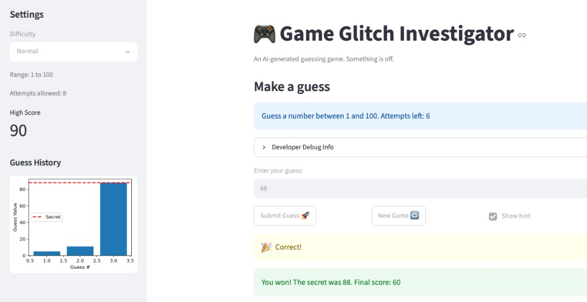

# Game Glitch Investigator

A Streamlit number-guessing game where you try to find a secret integer within a difficulty-based range. You get a limited number of attempts, hints after each guess, and a running score that rewards fast wins and penalizes wrong guesses. This version fixes several bugs that made the original AI-generated build frustrating or impossible to play fairly.



## Demo Walkthrough

Sample game on **Normal** difficulty (range 1–100, 8 attempts). The secret number is 73.

1. Start a new game. The sidebar shows range 1–100 and 8 attempts left. Score is 0.
2. Guess **50** and submit. Hint: "Go HIGHER!" (50 is too low). Score drops to **-5**. Attempts left: **7**.
3. Guess **90** and submit. Hint: "Go LOWER!" (90 is too high). Score goes back to **0** (even-numbered attempts that are too high add 5 points). Attempts left: **6**.
4. Guess **80** and submit. Hint: "Go LOWER!" (still too high). Score drops to **-5**. Attempts left: **5**.
5. Guess **70** and submit. Hint: "Go HIGHER!" (too low). Score drops to **-10**. Attempts left: **4**.
6. Guess **73** and submit. Correct — you win. Final score: **40** (50 win bonus on attempt 5, added to your running total of -10).

## Bugs Fixed

- **Reversed hints** — Guesses that were too high told you to go higher, and guesses that were too low told you to go lower; the messages now match the actual direction you need to move.
- **Attempts starting at 1** — A fresh game began with one attempt already used, so Normal mode showed 7 attempts left instead of 8; the counter now starts at 0.
- **Secret not resetting on difficulty change** — Switching difficulty updated the displayed range but kept the old secret, which could fall outside the new range; changing difficulty now generates a new secret within the correct bounds.

## How to Run

```bash
pip install -r requirements.txt
python3 -m streamlit run app.py
```

## Document Your Experience

The trickiest bug to track down was the attempt counter. On a fresh game it already looked like one guess had been used, which made the UI feel broken before you even played. The fix was small — initialize `attempts` to 0 instead of 1 — but it was easy to overlook because the rest of the game still ran.

Working with AI on this project taught me to treat suggestions as leads, not answers. When empty guesses still burned an attempt, the AI blamed `parse_guess`, but reading the code showed validation was fine and the real issue was that `app.py` incremented attempts before checking the input. Running pytest and using the Developer Debug Info panel confirmed what was actually happening. AI helped me spot the reversed hints quickly, but I still had to verify each fix myself.
